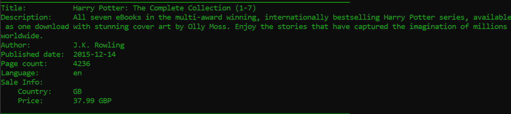
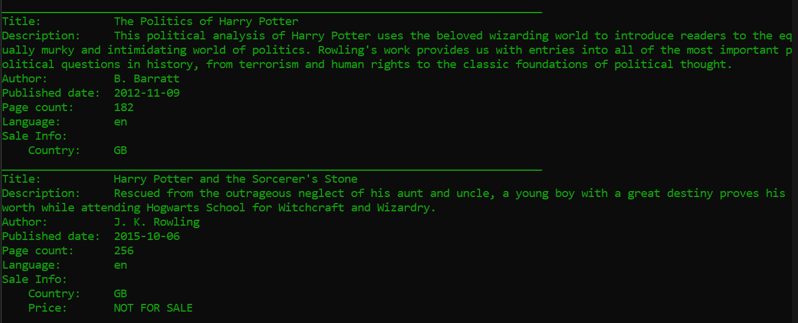
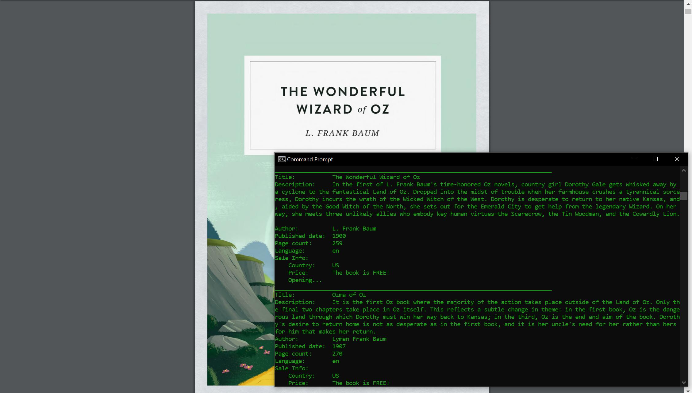

# Python-Google-Books-CLI
This a Google Books API CLI program used to query the book by a given title or an id. It **automatically opens the free listed books as Chrome tabs** where the books can later be downloaded if they are in PDF or added to Google Books App. 

Depending on your country, the results may vary.

## How to run this CLI

Prerequisites: 
  - Python
  - Requests package: 
    - To install requests package use: `pip install requests`
  - json package: 
    - To install json package use: `pip install json`
  - click package: 
    - To install click package use: `pip install click`
  - webbrowser package: 
    - To install webbrowser package use: `pip install webbrowser`
  - chrome path in: > "C:\\Program Files (x86)\\Google\\Chrome\\Application\\chrome.exe"
  
Clone or download the repository and run the googlebooks.py file navigate to the folder where the  .py file is located and use: `googlebooks.py search YOUR_BOOK_TITLE`

**Attention: if the book title has more than one word in it (most cases) type the title without white spaces.**

As an example, the following will appear: 

## Harry Potter Query in GB

Searched using: `googlebooks.py search harrypotter`

## Wizard of Oz in the US

Searched simply using: `googlebooks.py search oz`

